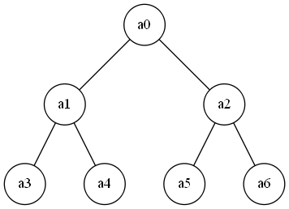
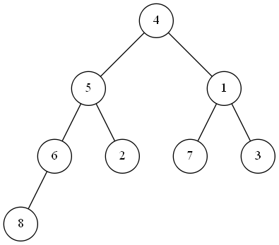

# 最小的k个数
## 题目描述
输入n个整数，找出其中最小的K个数。例如输入4,5,1,6,2,7,3,8这8个数字，则最小的4个数字是1,2,3,4,。

```java
public class Solution {
    public ArrayList<Integer> GetLeastNumbers_Solution(int [] input, int k) {
        //write code here     
    }
}
```
[牛客网OJ链接](https://www.nowcoder.com/practice/6a296eb82cf844ca8539b57c23e6e9bf?tpId=13&tqId=11182&tPage=1&rp=1&ru=/ta/coding-interviews&qru=/ta/coding-interviews/question-ranking)

---
## 解题思路
既然是求最小的k个数，很明显需要是要对数组进行排序。而题目又要求是求出前k个数因此不需要对整个数组进行全排序，能做到只排序前K个数的排序算法是堆排序。这里有基于堆排序的两种方案:
1. 普通堆排序
由于只需要求最小的前k个数，因此我们只需要先将原数组通过"下沉"方式堆有序化(此问题中是指任一节点都比自己的子节点小,即构造小顶堆)，此时我们可以知道堆中最小的元素即堆顶元素input[0]，因此我们只需要将堆顶元素与堆中未被排序的最后一个元素交换(视作将堆顶元素从堆中移除)，交换操作会破坏原来堆有序的状态，因此需要重新通过"下沉"方式调整堆至堆有序状态，如此操作k次便能得到最小的k个数，每次都将移除的堆顶元素保存在ArrayList中即可完成题目要求。
    - 由上至下的堆有序化(下沉)

        首先，二叉堆是一棵完全二叉树。我们可以将输入数组按层次有序构建一棵完全二叉树。如图所示，数组a[i]在对应的完全二叉树中的两个子节点分别为a[i * 2 + 1]与a[i * 2 + 2]：

        

        针对本例牛客网给出的数据对应的完全二叉树为:
        
        
        接着我们需要由上至下的将堆有序化，本例中我们是要构建一个小顶堆，因此需要将位置为k上的节点与比它小的子节点交换，将节点向下移动直到它的子节点都比它更大或者到达了堆的底部。这部分代码为:
        ```java
        /**
        * 下沉方式建堆
        * @param a 堆对应的数组
        * @param k 数组中第k个元素
        * @param n 堆大小
        */
        private static void sink(int[] a, int k, int n) {
            //当前节点的左子节点 >= 堆大小时候说明当前节点已经下沉到堆底了
            while (2 * k + 1 < n) {
                //记录左子节点
                int j = 2 * k + 1;
                
                //左子节点和右子节点比较大小，如果右子更小那么需要与右子节点交换来完成下沉
                //这里先判断左子节点是不是堆中最后一个元素了，即防止当前节点只有左子节点而造成后面判断数组越界
                if (j != n - 1 && a[j] > a[j + 1]) {
                    j++;
                }
                //如果当前节点已经比自己的子节点小了，那么直接跳出循环，当前节点已经符合堆有序的定义
                if (a[k] < a[j]) {
                    break;
                }
                //否则和子节点中更小的那个交换
                swap(a, k, j);
                //更改需要下沉的节点的位置，即更新为子节点的位置
                k = j;
            }
        }
        ```
        
        另外通过观察我们发现```array.length / 2```位置上以及之后的节点都为叶子节点，已经在堆的底部了因此无需参与下沉建堆的步骤。因此只需要将```0 ~ array.length / 2 - 1```位置上的节点依次下沉便能构建一个堆有序的结构。这部分代码很简单，只需要循环调用下沉建堆的方法即可:
        ```java
        for (int i = n / 2 - 1; i >= 0; i--) {
            sink(input, i, n);
        }
        ```
        执行完建堆步骤，如果对上面说的不理解的话可以手动一步步画一下。我们来看看```下沉```操作后的完全二叉树被调整成了什么样子:
        
        从图中我们可以看到经过我们的```下沉```步骤，这棵完全二叉树已经符合堆有序的定义了，即每一个节点都比它的两个子节点要小。那接下来的工作只剩下依次去除最小的k个数了。
    - 对前k个数下沉排序
    
        说了这么多，我们还是没有说到怎么取出最小的k个数。但是我们已经构造出了一个小顶堆了，观察这个小顶堆你会发现最小的数在堆顶，因此我们将堆顶元素与堆底最后一个元素交换视为将最小的元素从堆中移除，同时因为这次交换操作导致堆有序状态被破坏，因此需要调用一次```sink```方法来调整堆。这里我们很容易想到因为最小的元素已经被我们从堆中移除，那么重新调整后的堆的堆顶元素便是原数组中第二小的数了。重复k次，每次调整都将从堆中移除的元素保存在容器中，便能得到符合题目要求的答案了。若k为数组长度便相当于对原数组进行了一次全排序。代码像下面这样:
        ```java
        //n为数组长度，每次移除一个元素堆大小都会-1
        for (int i = 0; i < k; i++) {
            //交换堆顶元素和数组最后一个元素，视作将堆顶元素从堆中移除。第一次n为数组长度。
            swap(input, 0, --n);
            sink(input, 0, n);
            result.add(input[n]);
        }
        ```

2. 优先队列：
优先队列也是基于堆结构实现的，但是应用场景在于数据输入量非常巨大，甚至是无限的。只用一个堆来保存最大或最小的几个数，以实现对数级别的删除最大元素和插入元素操作，且不需要等到所有数据输入完成才来做统一排序。但是此例中并不适用，题目条件下，输入量势必是可以接受的。如果想使用优先队列，java有内置的API，我这里贴一个牛客网上该题讨论区的答案：
    ```java
    public class Solution {
        public ArrayList<Integer> GetLeastNumbers_Solution(int[] input, int k) {
            ArrayList<Integer> res = new ArrayList<>();
            if (input == null || k <= 0 || k > input.length) {
                return res;
            }
            Queue<Integer> queue = new PriorityQueue<>(k, Collections.reverseOrder());
    
            for (int i = 0; i < input.length; i++) {
    
                if (queue.size() < k) {
                    queue.add(input[i]);
                } else {
                    if (input[i] < queue.peek()) {
                        queue.remove();
                        queue.add(input[i]);
                    }
                }
            }
            while (!queue.isEmpty()) {
                res.add(queue.remove());
            }
            return res;
        }
    }
    ```

---
## 参考代码
```java
import java.util.ArrayList;
import java.util.Arrays;

public class Solution {
    public ArrayList<Integer> GetLeastNumbers_Solution(int[] input, int k) {
        ArrayList<Integer> result = new ArrayList<>();
        //建堆
        int n = input.length;
        if (k > n) {
            return result;
        }
        for (int i = n / 2 - 1; i >= 0; i--) {
            sink(input, i, n);
        }


        for (int i = 0; i < k; i++) {
            swap(input, 0, --n);
            sink(input, 0, n);
            result.add(input[n]);
        }
        return result;
    }

    /**
     * 下沉方式建堆
     * @param a 堆对应的数组
     * @param k 数组中第k个元素
     * @param n 堆大小
     */
    private static void sink(int[] a, int k, int n) {
        //当前节点的左子节点 >= 堆大小时候说明当前节点已经下沉到堆底了
        while (2 * k + 1 < n) {
            //记录左子节点
            int j = 2 * k + 1;

            //左子节点和右子节点比较大小，如果右子更小那么需要与右子节点交换来完成下沉
            //这里先判断左子节点是不是堆中最后一个元素了，即防止当前节点只有左子节点而造成后面判断数组越界
            if (j != n - 1 && a[j] > a[j + 1]) {
                j++;
            }
            //如果当前节点已经比自己的子节点小了，那么直接跳出循环，当前节点已经符合堆有序的定义
            if (a[k] < a[j]) {
                break;
            }
            //否则和子节点中更小的那个交换
            swap(a, k, j);
            //更改需要下沉的节点的位置，即更新为子节点的位置
            k = j;
        }
    }

    /**
     * 用于交换数组中两个数的辅助方法
     * @param a 要交换的数所在的数组
     * @param i 第一个数在数组中的索引
     * @param j 第二个数在数组中的索引
     */
    private static void swap(int[] a, int i, int j) {
        int t = a[i];
        a[i] = a[j];
        a[j] = t;
    }
}
```
>说明：代码在牛客网的OJ是通过运行的，如果使用其它OJ可能需要更改。另外防止我手滑粘贴错导致不能运行的，原工程在2017-10/coding-interviews/print-list-from-tail-to-head

>ps: 终于找到一个好的画图工具了..本文中的图都是用```graphviz```画的

(完 2017年11月8日)