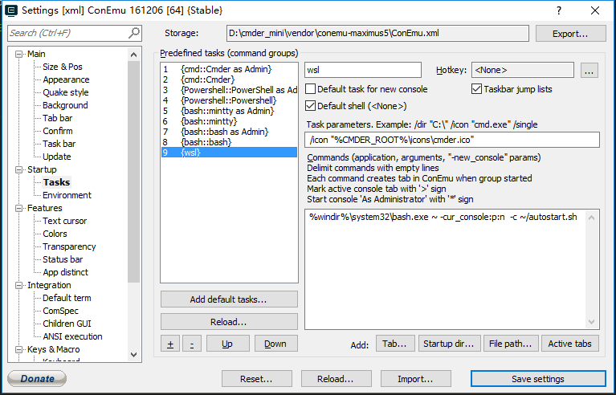

# Windows Subsystem for Linux使用全记录
微软大概为了和```OS X```竞争，在```windows```环境下加入了一个```linux```子系统，据说是目前最好用的Linux发行版(滑稽)。我个人看来的话是有学习```linux```或者某些业务场景需要使用但不想装虚拟机的话```wsl```确实是一个不错的选择，事实上也确实比虚拟机流畅。

---
## 安装
在我安装的时候需要在设置中的```针对开发人员```选项中勾选```开发人员模式```，然后在控制面板中```启用或关闭Windows功能```中勾选```适用于Linux的Windows子系统```，最后在cmd中输入```bash```命令等待下载完成即可。最新的windows周年更新后貌似可以直接在应用商店下载(搜索Ubuntu)，我没有尝试过。

---
## 使用Cmder
当然你不用也没有关系，wsl自带了一个终端，我觉得它太丑，所以找到了cmder。可以在[cmder官网](http://cmder.net/)下载解压后直接可以使用。cmder默认终端是cmd，因此你可以直接输入```bash```命令来进入wsl，如果觉得这样比较麻烦，你可以在设置中新增一个task来快速打开，就像下面这样:



需要在右边输shell启动命令的地方输入
```cmd
%windir%\system32\bash.exe ~ -cur_console:p:n 
```
这样设置完之后在cmder中点击```create new console```那个绿色的加号旁边的三角便能看到刚刚新增的wsl条目。如果你想将wsl在你打开cmder之后便立即启动则需要在下图的```start up```中设置:


到这里之后你每次启动cmder便会自动进入wsl

---
## 安装zsh
这部分网上教程比较多，和其它任意linux发行版安装方式都类似。不再多说，给两个我安装时的参考链接。
- [在ubuntu中安装与配置zsh与oh-my-zsh](http://www.jianshu.com/p/546effd99c35)
- [解决Bash On Ubuntu On Window安装Zsh无效问题附安装说明](http://www.jianshu.com/p/9a575dda0eff)

---
## 服务自启动
wsl中的服务目前貌似是不会自启动的，比如你每次启动wsl都需要手动去启动redis服务。这个坑我在网上搜索之后找到一个曲线救国的方式来解决，即每次启动wsl时候调用一个启动服务的脚本，下面是一个例子:
在wsl主目录下新建一个```autostart.sh```来作为启动服务的脚本,例子中是一个启动redis服务的命令:
```bash
#!/bin/bash
sudo service redis-server start
bash
```
然后修改上文中提到的cmder启动wsl的命令在后面加上一个参数：
```cmd
%windir%\system32\bash.exe ~ -cur_console:p:n  -c ~/autostart.sh
```
这样便能在wsl启动时候去执行主目录下的```autostart.sh```服务启动脚本，但是这里还有一个坑，如果仅仅这么做每次启动都会让你输入密码，这样还是会稍显麻烦，因此我们还需要将sudo的密码给去掉。像下面这么做
```bash
cd /etc
sudo vim sudoers
```
然后```sudoers```的结尾加上
```bash
# username是你的用户名，不是root，比如我是wangl，则我这里是wangl ALL=(ALL) NOPASSWD:ALL
username ALL=(ALL) NOPASSWD:ALL
```
我这里是去掉了所有sudo的密码，如果你觉得这样做有安全问题那么可以针对特定的命令来设置不使用密码，这个自己去找资料。

到这里应该就可以像任意linux发行版一样正常使用。像redis、mongo、nginx、ssh之类的服务都可以在wsl里面跑，唯一不方便的地方是不能后台，一旦关闭cmder或者其它终端工具的窗口wsl便被关闭了。这里另一个曲线救国的方式是利用win10的多桌面，在另一个桌面开着cmder窗口，做一个假后台，但实际上如果强迫症没有特别严重也没什么必要。

---
## 参考
- [Linux Bash on Win10 (WSL)在cmder下使用vim时方向键失灵问题解决](http://www.cnblogs.com/hujq1029/p/6549073.html)
- [在ubuntu中安装与配置zsh与oh-my-zsh](http://www.jianshu.com/p/546effd99c35)
- [解决Bash On Ubuntu On Window安装Zsh无效问题附安装说明](http://www.jianshu.com/p/9a575dda0eff)
- [使用 Windows Subsystem for Linux 进行 Python 开发](https://juejin.im/entry/59352f62ac502e0068b12630)


(完 2017年11月2日)