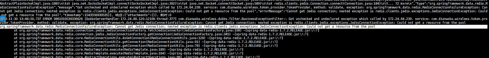
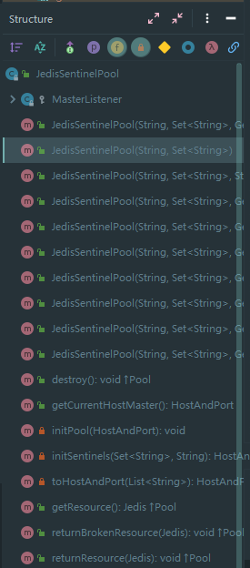

# 从redis实例迁移导致应用无法获得连接简单说说jedis的sentinel机制

## 现象

前段时间，因为运维同学在做redis的实例迁移导致使用那个master-name的服务都无法获取到redis连接并报错。报错信息如下：



奇怪的问题是服务在进行`重启`操作之后便又能拿到redis连接，服务正常了。另外观察到出现此现象的服务使用的redis客户端均为jedis。

## 原因

看到这个现象第一反应是jedis在服务端出现停机断线的情况后不会进行重连，在服务端恢复后客户端这边没进行重连操作导致。这也很好解释为什么重启之后便能恢复故障的现象。

但按理来说正常的实例迁移操作是不会造成服务都不可用的问题的，不然生产上redis服务端进行一次闪断，所有使用jedis的服务全会不可用。所以和运维同学一起做了个实验复现了当时的问题，便找到了原因。

### 运维操作步骤复现

#### 第一次实验

1. 删哨兵信息
2. 停master节点
3. 重启master节点

按照我最开始的想法，服务端出现闪断，jedis又没有重连机制，服务应该不可用才对。但奇怪的是问题并没有复现。此时我们开始怀疑redis服务端版本问题、spring-data版本问题。但我们把各个系统环境都和当时出问题的环境保持一致的时候按上述操作步骤仍然没有复现。而且发现了一个新的问题，在master节点没有停机的情况下即使把sentinel中的注册信息删掉，客户端仍然可以连上服务端。

#### 第二次实验

1. 删哨兵信息
2. 停master节点
3. 注册新的节点信息到哨兵

在一番尝试之后，运维同学决定和他那天进行实例迁移的操作步骤保持完全一致再来尝试一次。这两次实验的区别是在停掉master节点后的操作，第一次是重启了原来的master节点，第二次实验则是开了另一台实例上的master并把新的地址注册到sentinel中去。

按这次的操作步骤真的复现了当时出现的错误!

### JedisSentinelPool

结合两次实验便能大致猜出原因是什么了，之前的服务端断线jedis不会重连的想法是有问题的，大方向应该是jedis在启动的时候从sentinel拿到master节点的信息并缓存在内存里，并且之后再也不去sentinel中拿了。这也解释了在master节点没挂的情况下即便服务器上sentinel里已经没有注册信息了，但是客户端还是能正常的读写；同时也解释了为啥在做了实例迁移以后新的master节点起来了但是客户端仍然连不上，因为它拿的还是原来那台已经被关掉的节点地址。

去找了jedis连接部分的源码来看果不其然。Jedis对Sentinel的操作主要都在`JedisSentinelPool.java`这个类里，这个类的结构如下:



其中通过sentinel来找master节点的代码都在`initsSentinel()`方法中，这里简单贴一下:

```java
private HostAndPort initSentinels(Set<String> sentinels, final String masterName) {

    HostAndPort master = null;
    boolean sentinelAvailable = false;

    log.info("Trying to find master from available Sentinels...");

    //从配置的多个sentinel中遍历，其实并不需要遍历，一般都在某一个sentinel中能找到master信息了，遍历多个是防止其中一个sentinel挂掉导致连不上主节点。
    for (String sentinel : sentinels) {
        final HostAndPort hap = toHostAndPort(Arrays.asList(sentinel.split(":")));

        log.fine("Connecting to Sentinel " + hap);

        Jedis jedis = null;
        try {
            //jedis客户端先连接到sentinel
            jedis = new Jedis(hap.getHost(), hap.getPort());

            //根据masterName得到master的地址，master有多个节点，所以是list，从这里可以看到其实一个sentinel上就能得到全部的信息了。
            List<String> masterAddr = jedis.sentinelGetMasterAddrByName(masterName);

            // connected to sentinel...
            sentinelAvailable = true;

            if (masterAddr == null || masterAddr.size() != 2) {
                log.warning("Can not get master addr, master name: " + masterName
                        + ". Sentinel: " + hap + ".");
                continue;
            }

            master = toHostAndPort(masterAddr);
            log.fine("Found Redis master at " + master);
            //如果在任何一个sentinel中找到了便不用再继续遍历查找了
            break;
        } catch (JedisConnectionException e) {
            log.warning("Cannot connect to sentinel running @ " + hap
                    + ". Trying next one.");
        } finally {
            if (jedis != null) {
                jedis.close();
            }
        }
    }

    //如果执行到这里，master仍为null，要么所有的sentinel都不可用，要么master节点没有被存活的sentinel监控到
    if (master == null) {
        if (sentinelAvailable) {
            // can connect to sentinel, but master name seems to not
            // monitored
            throw new JedisException("Can connect to sentinel, but " + masterName
                    + " seems to be not monitored...");
        } else {
            throw new JedisConnectionException(
                    "All sentinels down, cannot determine where is " + masterName
                            + " master is running...");
        }
    }

    log.info("Redis master running at " + master + ", starting Sentinel listeners...");

    for (String sentinel : sentinels) {
        final HostAndPort hap = toHostAndPort(Arrays.asList(sentinel.split(":")));
        MasterListener masterListener = new MasterListener(masterName, hap.getHost(),
                hap.getPort());
        masterListeners.add(masterListener);
        masterListener.start();
    }

    return master;
}
```

这个initsSentinel()方法看了下只在JedisSentinelPool的构造方法里用到，也就是说大概率上是jedis只在启动创建连接池的时候会连上sentinel去查master节点的地址信息并缓存在内存里，从今以后只要服务还在拿到的永远都是启动时拿到的master节点。这和我们看到的现象是一致的。

### Failover

这个时候你可能会想，这不对呀!sentinel模式是redis的高可用模型啊,如果是这样，那发生master节点down掉的情况slave节点顶上，但如果我客户端拿到的注册信息还是原来的那不就相当于这种机制废了嘛。

但实际上注意看initsSentinel()方法最后，每一个sentinel都注册了一个`MasterListener`,这个`MasterListener`也很简单，订阅了sentinel上关于master节点地址改变的PUB消息。收到变更消息后，调用initPool()方法，这个方法会重建整个连接池,自然也会获得sentinel中变更后的节点信息从而来实现failover。

原来正常情况下的主从替换是可以处理的，只是测试环境报错那天的情况比较特殊，主从节点全挂了，运维才做了删除sentinel中注册信息并进行了实例迁移的操作。

## 再多说一点

写这个文章的时候我才想到一个问题，为什么在slave没挂master挂掉的情况下，slave会顶上来这时候会修改sentinel中的信息，此时我客户端订阅了你这个消息便会发生变更。那为啥slave和master都挂掉的情况，做实例迁移，手动修改sentinel中的信息便收不到这个pub消息了?

这一点确实不是很清楚，只能用一般注册中心的机制来类比推断了，例如zk，假设注册在zk上dubbo消费者没有重连机制(实际上有)，当我把zk的node节点删了，客户端和zk之间的订阅关系理论上也被删了，此时当一个注册在zk上的dubbo提供者发生变更，但是由于消费者与zk之间的订阅关系已经不存在，zk自然也无法通知到。如果zk是这样，那sentinel会不会也是如此呢?

这个疑问在问了运维同学之后，得到的回复是"主从都挂掉，再重新注册，就相当于是一个新的东西。不会对外发消息，只有发生变化的时候才会发生变化"。

在文档资料和运维同学的帮助下这个问题到这里就算是解决了，另外在实验过程中不仅测试了jedis，还测试了另一个redis客户端[lettuce](https://github.com/lettuce-io/lettuce-core)。发现lettuce客户端有重连处理器避免了jedis的这个问题。关于lettuce的处理以及两个客户端的对比后面另外再写一篇来说吧。