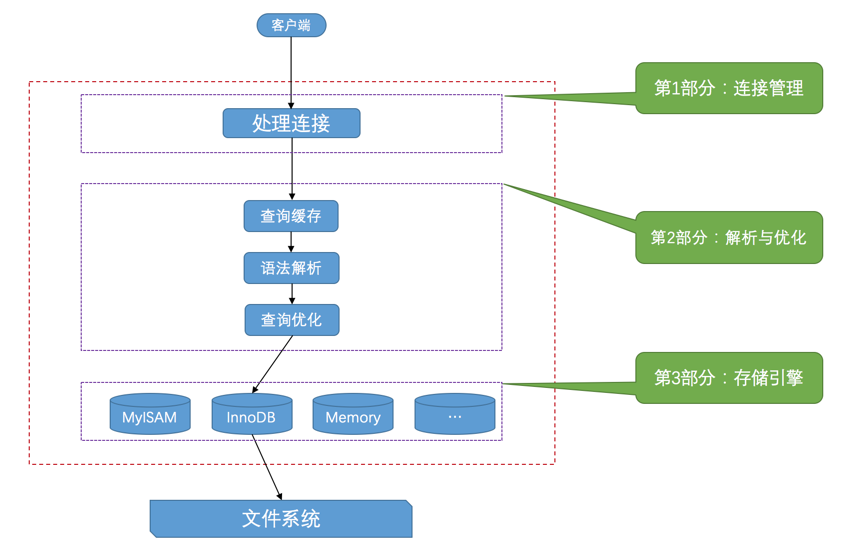

# MySQL是怎样连接的-笔记(1)

> 本文为[MySQL是怎样运行的](https://juejin.im/book/5bffcbc9f265da614b11b731)的读书笔记。按书的思路以及自己的理解整理了MySQL总体的内容。

## 启动与配置

MySQL是典型的C/S架构程序。`mysqld`为服务端程序，`mysql`为客户端程序。我们有可能并不直接运行`mysqld`，例如运行`mysql.server`、`mysqld_safe`，这些命令或脚本最终都调用了`mysqld`来启动MySQL服务，但他们更强大，在启动服务的同时提供了如自动重启等高级功能。

MySQL启动的时候可以通过在启动命令中添加配置参数来配置某些东西，例如`--host(-h)`、`--user(-u)`、`--default-storage-engine`，但更推荐的做法是将常用的配置写到配置文件中去，这样就不需要每次启动服务的时候都写一串命令。
以类unix操作系统为例，MySQL会按照下列路径依次读取配置文件:

1. /etc/my.cnf
2. /etc/mysql/my.cnf
3. SYSCONFDIR/my.cnf
4. $MYSQL_HOME/my.cnf
5. defaults-extra-file
6. ~/.my.cnf
7. ~/.mylogin.cnf

另外，配置文件中用`[]`的形式将配置分组，其中，`[server]`组下边的启动选项将作用于所有的服务器程序。比如上文提到的`mysql.server`、`mysqld_safe`因为最终调用的都是`mysqld`，所以他们在启动时都会读取`[mysqld]`中的配置，客户端相关配置也可以按此规律推导。

配置文件的优先级按照后面的覆盖前面的逻辑生效。无论是不同的配置文件还是同一个文件中的不同分组，都将以最后一个出现的启动选项为准。

最后，很多配置在运行时可以改变。甚至可以针对不同的某个客户端连接设置不同的配置，例如存储引擎。可以将某个客户端连接设置成`MyISAM`，将别的客户端连接设置为`InnoDB`。

你可能会纳闷，`default-storage-engine`这个配置项明明是服务端的，但为什么可以通过客户端的启动命令进行改变，那是因为MySQL的配置选项分为`GLOBLAE`与`SESSION`两种作用域，这个例子中的`efault-storage-engine`便是一个`SESSION`级别的配置项，因此也仅仅只对当前连接生效。

## 请求与处理

C/S架构的程序交互都可以抽象成“客户端与服务端建立连接，客户端发送请求 服务端处理请求，返回响应给客户端”。下图是MySQL运行大致的过程:

下面也从这个过程来分步说明一次sql语句的执行过程。

### 连接

客户端首先要和服务端建立数据库连接，才能向服务端发送增删改查的请求。

我们知道MySQL客户端和服务端其实是`mysql`和`mysqld`两个进程，而数据库连接操作实际上是MySQL客户端与MySQL服务端进行通信，那所谓的连接其实就是进程间通信。常用的进程通信方式有管道、共享内存、TCP socket、unix domain socket,而MySQL提供的连接方式也大抵如此:

- TCP Socket  
    这应该是使用最普遍的一种MySQL连接方式，也是我们日常开发过程中使用的，随着微服务化的流行，数据库RDS通常与应用服务器分离，数据库连接几乎都采用这种在TCP连接上建立一个基于网络的连接请求来完成任务。
- 其它连接方式
    当客户端和服务端都在同一台服务器上的时候，还可以使用`命名管道`、`共享内存`和`Unix域套接字`来进行连接。前两种在`Windows`上使用，第三种在`unix`上使用这些方式都是本地通信，不经过网卡，不需要进行TCP握手与挥手，性能自然也比TCP Socket的方式要快的多，但我们用不上。

### MySQL服务处理请求

- MySQL服务端收到客户端的连接后，会为每一个连接创建一个线程来与之交互，并且这个线程在客户端断开连接后会被缓存(MySQL服务端内部的连接池)。
- 在继续下一步之前，MySQL服务器会先去缓存中查询。这个缓存稍微有一点弱，他只会查询与客户端曾经发起的请求数据完全一致的请求。而维护这个缓存又要付出额外的开销，因此这个功能在`MySQL-8`中已经被移除。
- 对客户端发送的请求数据进行解析，将收到的文本数据按MySQL的语法进行解析，得到要什么，根据什么去查，去哪里查等其能识别的内容。在识别之后还会对客户端的查询语句进行优化,例如子查询转连接，外连接转内连接，表达式优化等等。这个优化得到的结果就叫做我们平时说的`执行计划`。
- 在知道去哪里读数据、读什么数据和用什么条件读数据之后，就要开始真正的去执行这个动作了。而这个操作实际上是一个物理磁盘的操作，具体怎么去表里读数据或是具体怎么把数据写到物理存储器中在MySQL中是由`存储引擎`来完成的。`MySQL`的设计也是将`存储引擎`和`MySQL服务器`分开，存储引擎做了与物理磁盘的交互，而将插数据、读索引等具体的动作封装成不同的api供`MySQL服务器`调用。

## 请求过程的编码转换

MySQL从发送请求到接收结果过程中会发生多次字符集转换，转换的过程中涉及对字符的编码和解码，如果编码和解码使用的字符集不一样便会造成乱码。简单记录一下这个过程:

1. 客户端使用操作系统的默认字符集对请求语句进行编码发到服务端。
2. 服务端使用`character_set_client`对应的字符集对客户端发送的请求进行解码，再使用`character_set_connection`对应的字符集对刚解码的字符进行编码。
3. 如果 `character_set_connection`对应的字符集和即将操作的`列`字符集不一致则还需要进一步转换。
4. 将从`列`获取到的字节串从该列使用的字符集转换为`character_set_results`对应的字符集后发送到客户端。
5. 客户端使用操作系统的字符集对结果进行解析。