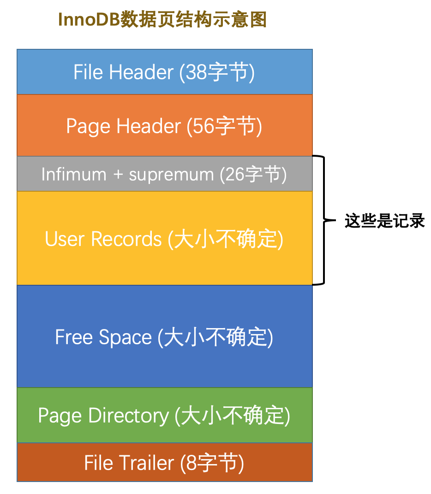
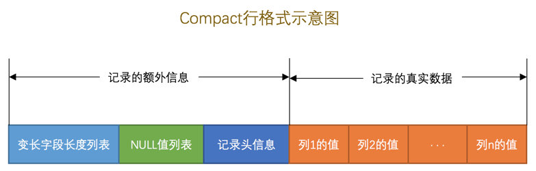
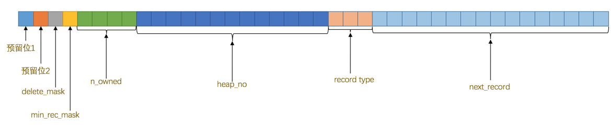
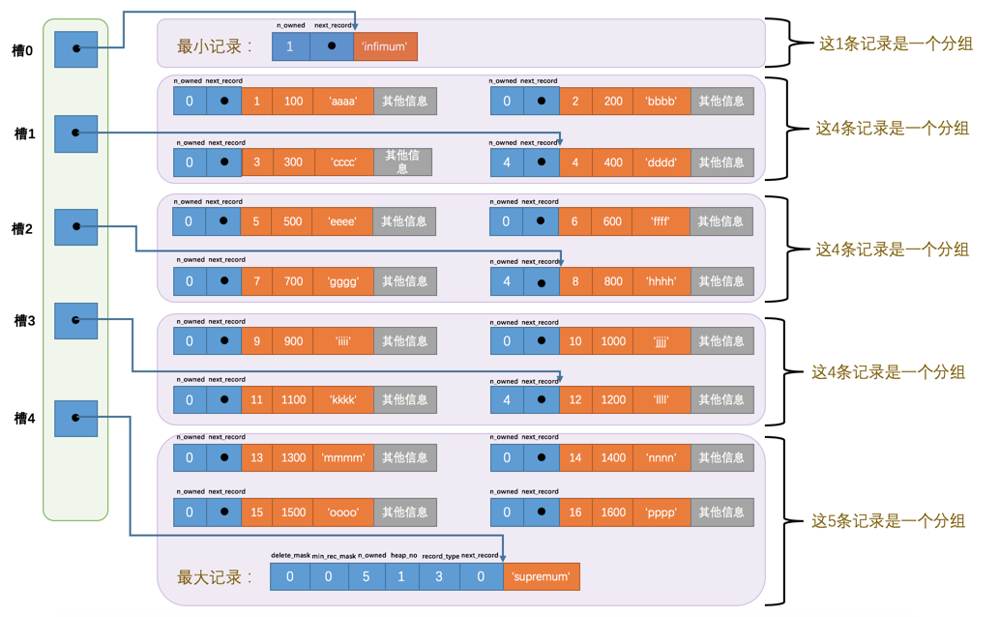
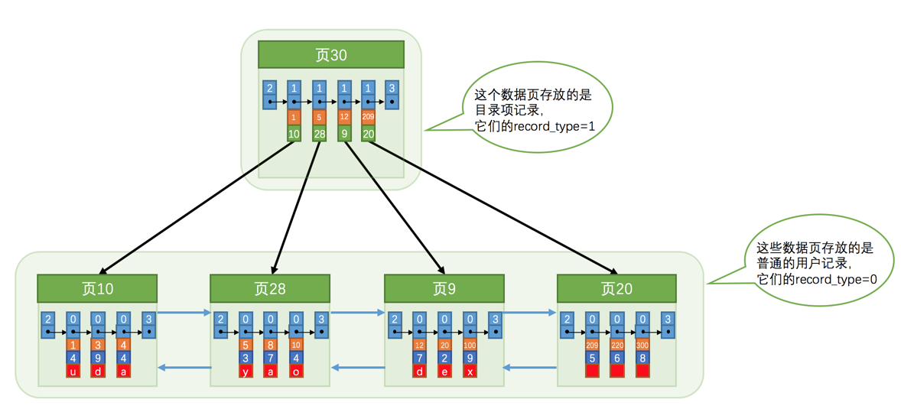

# MySQL是怎样连接的-笔记(2)

> 本文为[MySQL是怎样运行的](https://juejin.im/book/5bffcbc9f265da614b11b731)的读书笔记第二篇。按书的思路以及自己的理解整理了MySQL索引原理的相关内容。

## Innodb索引页与行格式
要说清楚索引，首先需要说明白的是`Innodb索引页`和`Innodb行格式`。`页`是MySQL存储数据的基本单位，一个页的大小一般是16KB。MySQL中有各种各样的`页`，而和数据存储相关的便是`索引页`。索引页的示意图如下:

我们每次插入记录，都是从索引页的`Free Space`中分配内存(分配得到的内存便是`User Records`部分了)，然后按照特定的`行格式`将记录存在`User Records`中。

那什么是`行格式`？所谓的InnoDB行格式就是记录在磁盘上的存放形式，以`COMPACT`行格式举例，其示意图如下:

因为本文只介绍索引相关的知识，并不需要对`InnoDB行格式`了解的太多，如果对`InnoDB行格式`有兴趣的同学可以去看作者原文。从`COMPACT`行格式示意图可以看到，一条记录除了我们记录的真实信息以外还有一些额外信息，我们需要对`记录头信息`这部分重点关注。

其中最最重要的两个字段是`n_owned`和`next_record`两个字段。`n_owned`表示索引页对页内数据分组后每组有多少条记录，至于什么是分组，我们后面再详细说。`next_record`表示当前记录到下一条记录的距离，由此可见记录和记录之间通过`next_record`形成了一条单向链表。

## 索引页中的分组与槽
再来仔细看看，索引页中的数据究竟是如何存储的。

这个图里没有将`next_record`的箭头画出,这里就自行想象一下吧。接下来我们来解释一下这张图。

1. 最小记录和最大记录：innodb索引页中规定了一个`页`中有两条固定的记录，分别是最小记录和最大记录。
2. 分组与槽：索引页按照主键大小将`页`里面的数据分成多个组，每组的记录条数在4-8条之间，如果一直往一个组内添加记录直到超过了8条那么则分裂出第二个组。然后将每一组中最大的那条记录单独摘出来放在`页目录`中称之为`槽`。

当我们搞清楚`槽`和`页目录`的概念后我们就能知道如何在一`页`中查找一条记录了。因为槽与槽是按顺序存在页目录中的，他们代表的记录也是按主键值排序的。那么可以使用二分查找确定待查询记录所在分组对应的槽，然后按`next_record`遍历槽对应的组中的各个记录。因为这个记录很少，所以查询速度极快。

回头想一想，假设没有`槽`和`页目录`的设计，我们又该如何查找呢？那就得从`页`的最小记录开始依次往后遍历，直到找到待查记录，当页内记录非常多时，查询效率就变得非常低下。

## 索引

聊完索引页中的分组和槽，我们只能解决在一个`页`中的根据主键查询的问题。如果记录数多到有好多页，那我们就需要先定位到对应的页才能根据槽去查询；又或者我们并不以主键作为条件去查询记录,而上述的高效率查找方式是仅适用于主键查找的。这时候就需要`索引`来解决这两个问题了。

### 记录数有很多页怎么办

从`索引页`的存储结构(槽与页目录)中得到灵感，直接为`索引页`本身建立一个目录不就好了吗?而MySQL也确实是这么做的。将每一页的最小用户记录的`主键`和`页号`单独摘出来放在一个单独的地方，那我们就可以使用二分查找快速定位到记录所在的页，然后在一页中采用之前说的方案去定位记录就好了。

然后要解决的问题就是这个单独存放`主键`和`页号`用来索引`页`的结构应该长啥样，这个问题的难点一个在于记录越来越多时需要很大的存储空间，另一个在于记录存在增删改时对应的索引结构也需要发生变化。仔细想一想，这里两个难点是不是跟存储记录时的问题是一样的？既然是一样的，那直接复用存储记录的`索引页`便可以了(当然了，有一个行格式中的record_type字段区分了两种页的类型)。我们来看一下图。

在这种结构下实现快速定位记录就需要先找到存储`用户记录页`页号的页，然后在存储`用户记录页`页号的页当中确定用户记录页，再根据槽和页目录找到记录。你很快就会发现当数据越来越多的时候，定位存储`用户记录页`页号的页效率也变得很低，那解决方案自然是往上再加一层索引。这个数据结构就叫`B+树`，这棵以主键构造的`B+树`被叫做`聚簇索引`，它的叶子节点存储的是完整的用户记录。

### 不以主键为条件的查找怎么办

解决这个问题的方案是以别的条件再建一颗甚至多棵`B+树`，当然这里新建的树的排序规则就得是对应字段的排序规则。不同于主键索引的B+树，以其他条件建立的树的叶子节点中只存了当前索引字段和主键的值。如果你想得到完整的用户记录，那么得拿着这棵树中得到的主键值再去主键索引中查询一次，这个过程叫做`回表`，也正因为如此，以非主键字段构建的B+树索引成为`二级索引`。

### 索引别的知识点

1. B+树的根节点随着索引创建而创建，在插入记录后，会把用户记录存储到根节点中，在根节点的可用空间被存满后，会新分配一个页，从根节点复制所有数据并完成页分裂，然后将分裂后的索引数据存到根节点中。根节点自身的页号会被存储到某个地方，这个便是`数据字典`。

2. 二级索引中不仅会存索引列的字段值，同时也会存主键的值，在索引列值相同时使用主键排序。

3. 联合索引的排序规则为先按第一个索引列进行排序，如果第一个索引列的值相同才进行第二个索引列的排序。
